## Overview

```{css}

.reveal pre.sourceCode code{
  background-color: #F0F0F0;
}

.reveal h2 {
  font-size: 2.2em;
}

ul {
  font-size:1.6em;
}

/* Stops nested increase in font size */
ul ul {
  font-size: 1em;
}

code.sourceCode {
  font-size: 0.8em;
}

.largecode code.sourceCode {
font-size: 2.2em;
}

.mediumcode code.sourceCode {
font-size: 1.6em;
}

p.smalltext {
font-size: 30px !important;
}

table {
font-size: 30px;
}

.centre_image {
  display: block !important;
  margin-left: auto !important;
  margin-right: auto !important;
}

.reveal .footer {
  display: flex;
  position: absolute;
  bottom: 100;
  width: 100%;
  margin-left: 200px;
  text-align: center;
  font-size: 0.7em;
  color: #264688;
  z-index: 2;
  margin-right: 250px;
}

/*logo*/
.reveal .slide-logo {
  height: 5% !important;
  max-width: unset !important;
  max-height: unset !important;
  padding: 10px
}


```

:::{.incremental .highlight-last}
-   What is Shiny?
-   Best practices in Shiny development
-   How Shinyscholar helps to avoid common problems
-   Disagapp and MetaInsight as examples
-   Limitations and future directions
:::

## About me

::: columns
::: {.column width="60%"}
:::{.incremental .highlight-last}
-   Background in plant sciences and agricultural science
-   Latecomer to R, starting in 2018
-   Biostats group in Leicester 2023-2026
-   RSE in Geostatistics for Population Health with Claudio Fronterre and Emanuele Giorgi
:::
:::
::: {.column width="10%"}
:::
::: {.column width="30%"}
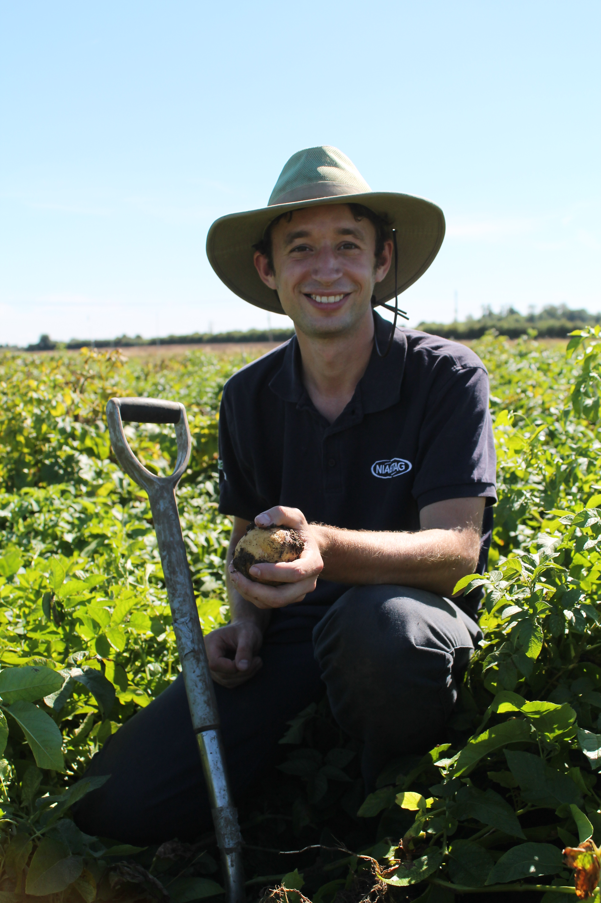
:::
:::

## More of a problem statement?

- Little point developing fancy models if those who could benefit can't use them

## Shiny enables the creation of applications in R
::: columns
::: {.column width="70%"}
- Reactive framework for developing applications using R    
- Developed by Posit/Rstudio, first released in 2012     
- Can run locally or online
- Make it much easier to share code with non R-users
:::
::: {.column width="30%"}


:::
:::


::: {.notes}
- Anything in R can be made GUI with Shiny
- Large ecosystem of packages create since
- Especially easy to make available online through Rstudio
:::


## Perceived negatives of Shiny

:::{.incremental .highlight-last}
- Difficult or impossible to test
- Slow
- Hangs during slow tasks
- Limited features for authentication and saving state
:::

:::footer
<a href="https://reside-ic.github.io/articles/web-apps/" target="_blank">https://reside-ic.github.io/articles/web-apps/</a>
:::

## Positives of Shiny

:::{.incremental .highlight-last}
- Easy to deploy and runs as a single service
- Very easy to run locally
- Statisticians are familiar with R
:::

## Shiny apps are becoming increasingly popular in academia

::: columns
::: {.column width="55%"}
-   The low barrier to entry makes Shiny popular
-   Substantially increased apps as a method of dissemination
-   "shiny app" OR "shiny application" in Web of Science:
:::

::: {.column width="45%"}
```{r echo = FALSE, fig.height=10}
year <- c(2012, 2015:2025) 
apps <- c(1, 4, 3, 12, 17, 39, 69, 75, 100, 154, 151, 216)
mod <- lm(log(apps) ~ year)

par(cex = 1.5, bg = '#d8e6e4')
plot(year, apps, pch = 16, xlab = '', ylab = 'Number of publications')
lines(seq(2012, 2025, 0.1), exp(predict(mod, data.frame(year = seq(2012, 2025, 0.1)))), col = 'blue')

```
:::
:::

::: {.notes}
-   Easier to develop than using other web frameworks
- Existing code can be adapted
:::

## Creating analytical apps lowers the barrier of entry

:::{.incremental .highlight-last}
- Provide guidance throughout a complex analysis
- Enable users without coding skills to access cutting-edge analyses
- Enable access for restricted users e.g. in NHS
:::

::: {.notes}
- Link to data pipeline - provide handrails for the user 
:::

## Data is transferred between the UI and server through the input and output {.mediumcode}

```{r eval = FALSE, echo = TRUE}
ui <- fluidPage(
  numericInput("number", "Enter a number", value = 5),
  textOutput("answer")
  )

server <- function(input, output) 
  output$answer <- renderText(input$number * 10)

shinyApp(ui, server)
```

::: {.notes}
- Note number and input$number, output$answer, answer
- Whenever input values change, the code that uses them is rerun
- The beauty of shiny is that we don't have to manage the (complicated) communication process between the web page and the server
:::

## What characteristics should academic apps have?

::: columns
::: {.column width="50%"}
::: {.fragment .fade-in}
-   Open
:::
::: {.fragment .fade-in}
-   Attributable
:::
::: {.fragment .fade-in}
-   Instructive
:::
:::

::: {.column width="50%"}

::: {.fragment .fade-in}
-   Reproducible
:::
::: {.fragment .fade-in}
-   Reliable
:::
::: {.fragment .fade-in}
-   Maintainable
:::
:::
:::

::: {.notes}
- We are all familiar with the format and conventions of papers, but they weren't always like that. Should we aim to develop similar conventions for apps?

- Open enables reuse and collaboration
- Important to recognise developers of the software like authors of a paper
- Users should be guided through inside of the application, not through watching videos or reading a guide 
- Analyses performed in the app should be reproducible outside of it
- We should be confident that it functions as intended through the use of automated testing
- Contracts are short, so it is important people unfamiliar with the code can understand what is happening.

:::

## How should app code be structured?

::: columns
::: {.column width="20%"}
:::
::: {.column width="15%"}
::: fragment

:::
:::
:::

## How should app code be structured?
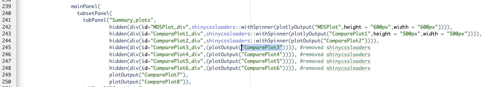
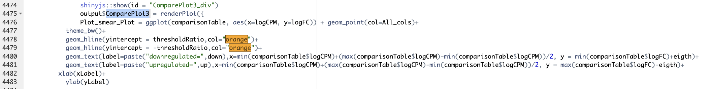

## How should app code be structured?
::: columns
::: {.column width="20%"}
:::
::: {.column width="15%"}

:::

::: {.column width="15%"}
::: fragment

:::
:::

::: {.column width="15%"}
::: fragment
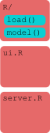
:::
:::

::: {.column width="15%"}
::: fragment
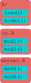
:::
:::
:::

## Modules enable apps to be broken down into self-contained chunks

:::{.incremental .highlight-last}
-   Inputs and outputs for different parts are separated
-   Simplifies naming of objects
-   Easier to navigate files and maintain code
-   But they need to be able to communicate...
:::

::: {.notes}
- Mini apps within an app
- Allows multiple objects with the same name in different modules
- Similar to chunks in Rmd / scripts in a large analysis
:::

## Packages ease development and distribution of code

::: columns
::: {.column width="70%"}
-   R packages parcel up code for distribution to others
-   Many tools and processes rely on code being a package
-   Enables installation in a single line
:::
::: {.column width="30%"}
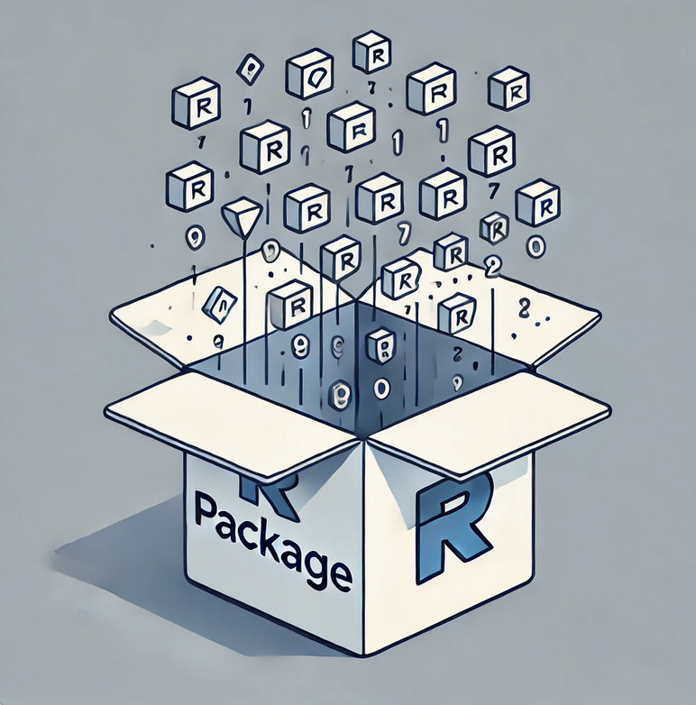
:::
:::

## 50 apps published in 2023 were surveyed to determine current practices

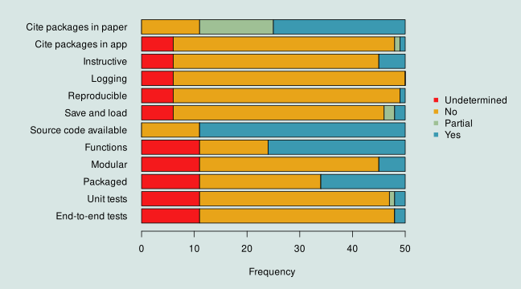

::: {.notes}
- Caveat: not all were analytical applications
- i.e. whilst best practice, they are not used due to the difficulty of implementation
:::

## The size and structure of codebases varied substantially
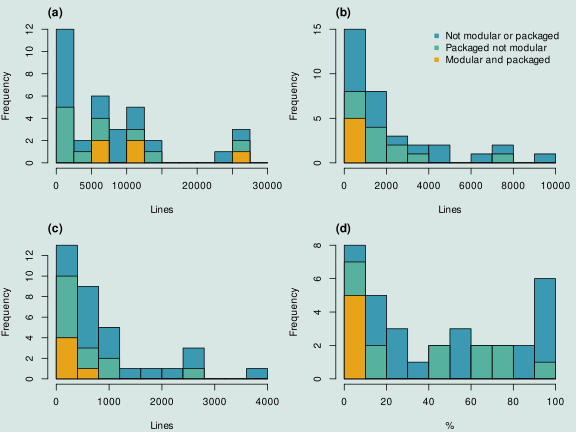

## Wallace is an app for modelling species distributions
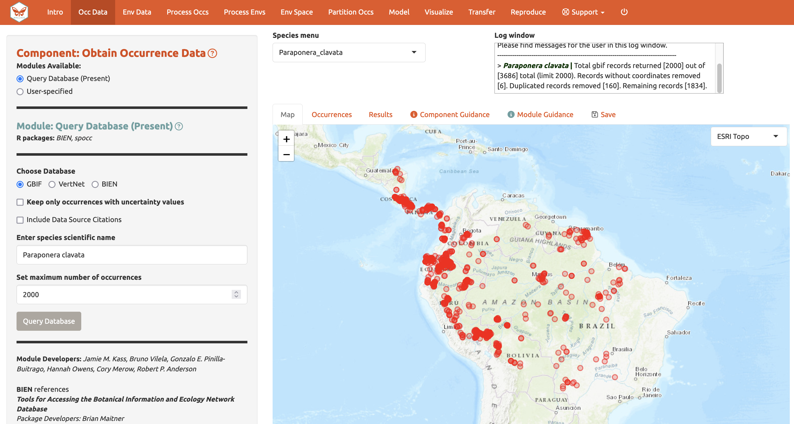

## Wallace is an app for modelling species distributions

-   In development since 2015 with two major releases
-   Feature-rich with many ideal characteristics:

::: columns
::: {.column width="50%"}
-   Error messages
-   Logging
-   Save and load
:::
::: {.column width="50%"}
-   Reproducible
-   Cites packages used
:::
:::

::: footer
- Kass *et al.* (2018) <a href="https://doi.org/10.1111/2041-210X.12945" target="_blank">DOI: 10.1111/2041-210X.12945</a>
- Kass *et al.* (2022) <a href="https://doi.org/10.1111/ecog.06547" target="_blank">DOI: 10.1111/ecog.06547</a>
:::

## Wallace provided the basis to create a template

:::{.incremental .highlight-last}
-  Templates / frameworks exist for other use cases
-  Lots of useful features that are difficult to implement
-  Adapted files so they could be edited programmatically
-  Made various changes to add functionality 
:::

::: footer
<a href="https://cran.r-project.org/package=golem" target="_blank">golem</a>,
<a href="https://cran.r-project.org/package=rhino" target="_blank">rhino</a>,
<a href="https://cran.r-project.org/package=teal" target="_blank">teal</a>
:::

## Shinyscholar helps create high quality analytical applications

::: columns
::: {.column width="70%"}
-   Creates an empty application with a regular structure
-   Make it easier to follow software development best practices
-   Developers can concentrate on creating functionality 
:::
::: {.column width="30%"}

:::
:::

## Shinyscholar enforces a strict architecture

:::{.incremental .highlight-last}
-   Analyses are split into components and modules
-   Each module calls one function
-   Each module is reproduced by an Rmarkdown chunk
-   Data is passed between modules through `common`
-   Apps are distributed as packages
:::

## `create_template()` creates an empty app {.mediumcode}

```{r eval = TRUE, echo = FALSE}

modules <- data.frame(
"component" = c("load", "load", "plot", "plot"),
"long_component" = c("Load data", "Load data", "Plot data", "Plot data"),
"module" = c("user", "database", "histogram", "scatter"),
"long_module" = c("Upload your own data", "Query a database to obtain data", 
                  "Plot the data as a histogram", "Plot the data as a scatterplot"),
"map" = c(TRUE, TRUE, FALSE, FALSE),
"result" = c(FALSE, FALSE, TRUE, TRUE),
"rmd" = c(TRUE, TRUE, TRUE, TRUE),
"save" = c(TRUE, TRUE, TRUE, TRUE),
"async" = c(TRUE, TRUE, TRUE, TRUE),
"download" = c(FALSE, FALSE, TRUE, TRUE))
```

```{r val = TRUE, echo = FALSE}
knitr::kable(modules,format = "html")
```

## `create_template()` creates an empty app {.mediumcode}

```{r eval = FALSE, echo = TRUE}

common_objects = c("raster", "histogram", "scatter")

shinyscholar::create_template(
  path = file.path("~", "Documents"), name = "demo", author = "Simon E. H. Smart",
  include_map = TRUE, include_table = TRUE, include_code = TRUE, 
  common_objects = common_objects, modules = modules, install = TRUE)

demo::run_demo()
```

::: {.notes}
 - Forces a design phase upon developers
:::

## Developers can then start developing modules
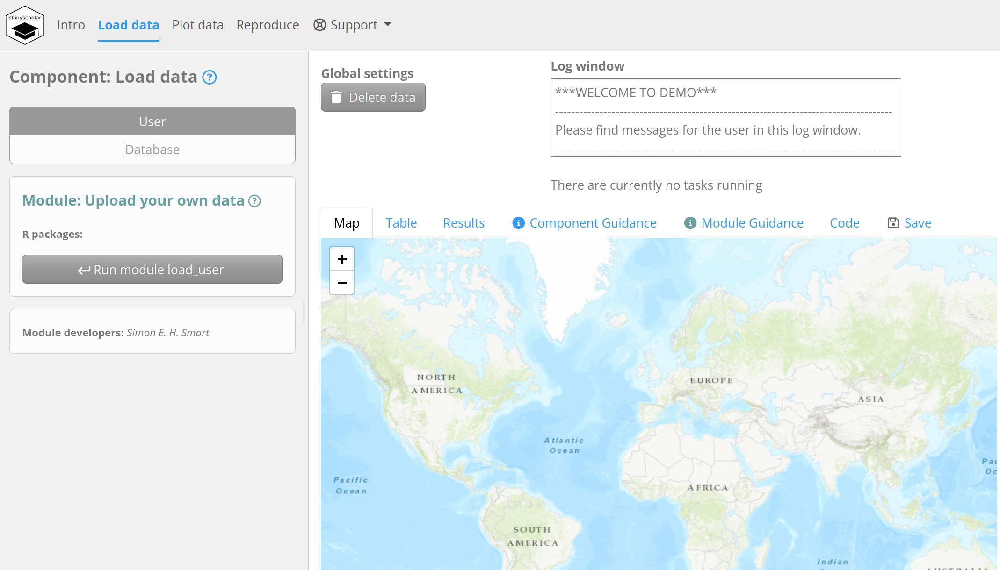

## Each module has several files associated with it
-   The component and module names are merged to create an identifier e.g. `load_user`

::: columns
::: {.column width="50%"}
-   Function: `<id>_f.R`
-   Module: `<id>.R`
-   Markdown: `<id>.Rmd`
:::
::: {.column width="50%"}
-   Guidance: `<id>.md`
-   Configuration: `<id>.yml`
-   Tests: `test-<id>.R`
:::
:::

## Markdown files can be merged to replicate the analysis

:::{.incremental .highlight-last}
-   When a module is used an object becomes `TRUE`
-   Input values are stored and *knitted* into the Rmarkdown
-   Each chunk of the markdown calls the same function as the module in the app
-   The chunks for used modules are combined into one `.Rmd` file
:::

## Input values are copied into the markdown {.mediumcode}

````markdown
```{{asis, echo = {{summary_network_knit}}, eval = {{summary_network_knit}}, include = {{summary_network_knit}}}}
### Display the networks for the original data and data with excluded studies.
{r,  results = 'asis'}
```
```{{r, echo = {{summary_network_knit}}, include = {{summary_network_knit}}}}
summary_network(configured_data,
                {{summary_network_style}}, 
                {{summary_network_label_all}}, 
                "Network plot of all studies")
```
````

## To create a reproducible chunk {.mediumcode}

````markdown
### Display the networks for the original data and data with excluded studies.

```{{r, results = 'asis'}}
summary_network(configured_data, 
                "netplot", 
                1, 
                "Network plot of all studies")
```
````

## Boring, repetitive coding tasks are automated {.mediumcode}

-   `save_and_load()` and `metadata()` automate these parts

```{r echo = TRUE, eval = FALSE}
numericInput("number", "Enter a number", value = 5)

list(number = input$number) # save
updateNumericInput(session, "number", state$number) # load
common$meta$comp_mod$number <- input$number # store
comp_mod_number <- common$meta$comp_mod$number # transfer to Rmd
{{comp_mod_number}} # use in Rmd

```

::: {.notes}
-   Code required for saving/loading and reproducibility is repetitive
:::

## Test
```{r echo = TRUE, eval = FALSE}
app <- shinytest2::AppDriver$new(app_dir = system.file("shiny", package = "metainsight"))
app$set_inputs(tabs = "setup")
app$upload_file("setup_load-file1" = file.path(test_data_dir, "continuous_wide_disconnected.csv"))
app$click("setup_load-run")
app$set_inputs(setupSel = "setup_configure")
app$click("setup_configure-run")
common <- app$get_value(export = "common")
 
```

## Async problem

<demo app>

## Extended task and mirai


## Disaggregation regression enables high resolution disease mapping
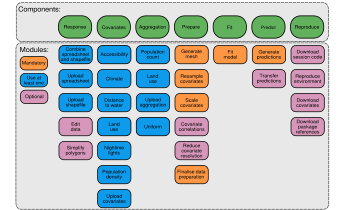

## Disagapp demo


## 

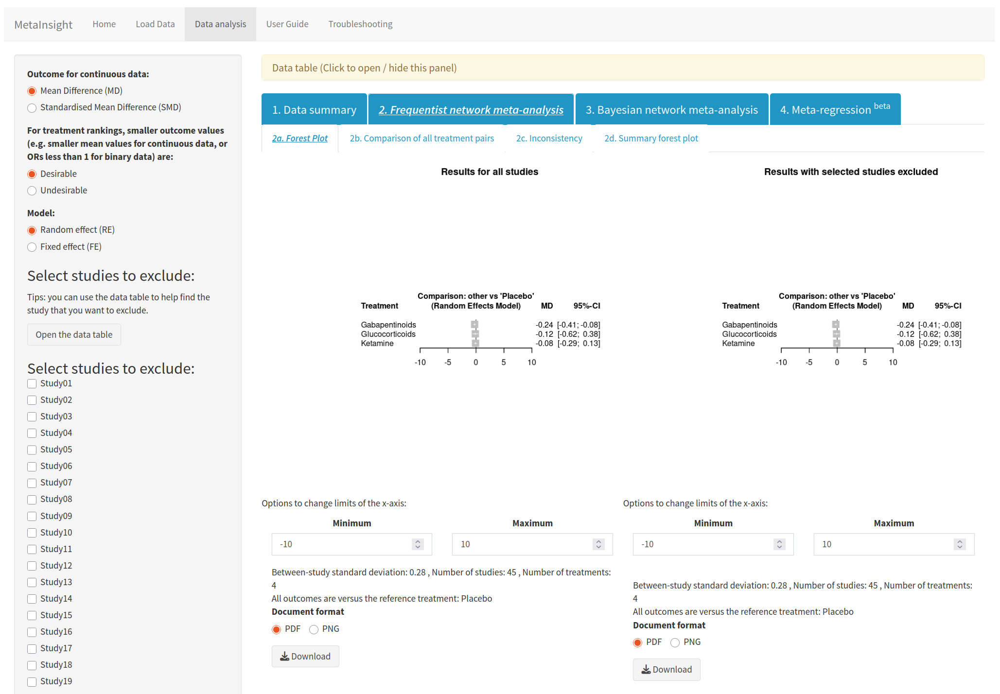


## Limitations

:::{.incremental .highlight-last}
- Added complexity
- UI design may not be appropriate for all apps
- Full paths for uploaded files cannot be reproduced
- Reproducibility is only a snapshot
- Code has to be rerun to generate a report
- Hosting
:::

## Future development

:::{.incremental .highlight-last}
- More options for UI
- Updating the logger mid-way through long tasks
- Spinning up exact copies from saved files
- Python? 
:::

## Resources

- CRAN:
  - <a href="https://cran.r-project.org/package=shinyscholar" target="_blank">shinyscholar</a>
  - <a href="https://cran.r-project.org/package=metainsight" target="_blank">metainsight</a>

-  <a href="https://github.com/simon-smart88 " target="_blank">github.com/simon-smart88</a>:
  -   shinyscholar
  -   disagapp
  -   These slides (bobw_seminar)
- <a href="https://github.com/CRSU-Apps/MetaInsight/" target="_blank">github.com/CRSU-Apps/MetaInsight/</a>

## Acknowledgments

::: columns
::: {.column width="50%"}
-   Wellcome
-   Wallace developers
-   Tim Lucas and Alex Sutton
-   CRSU developers
:::

::: {.column width="50%"}
<div> 


</div>
:::
:::
